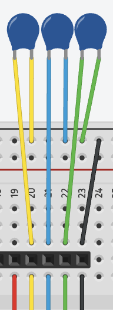
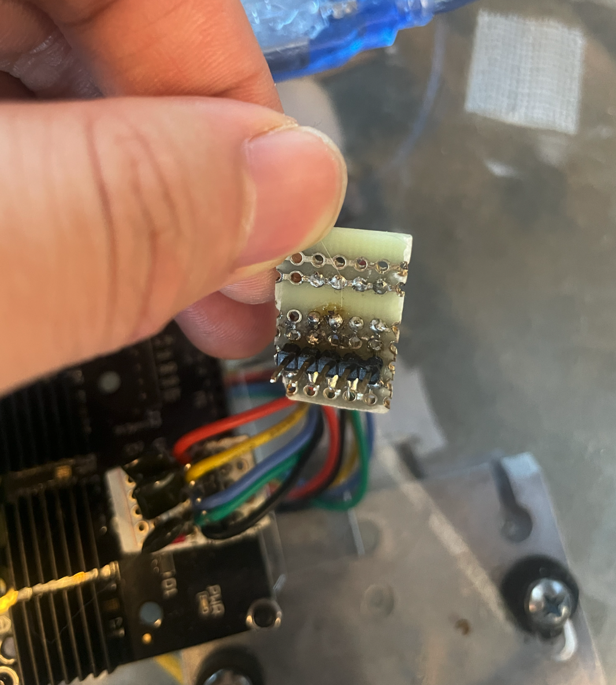
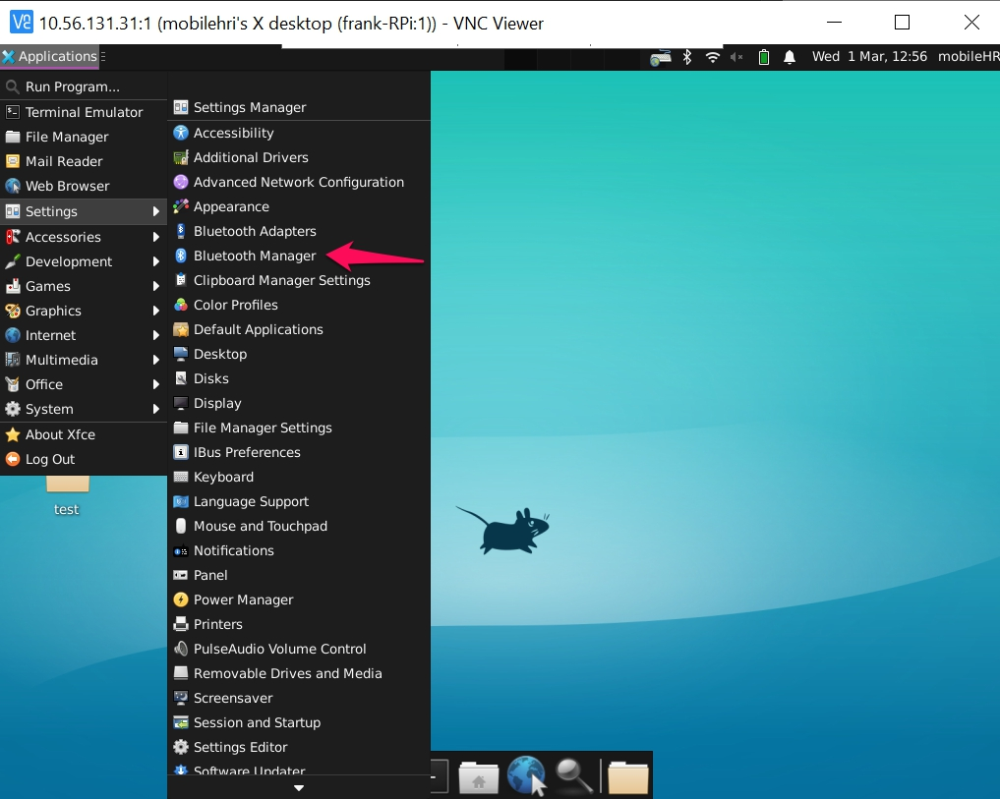
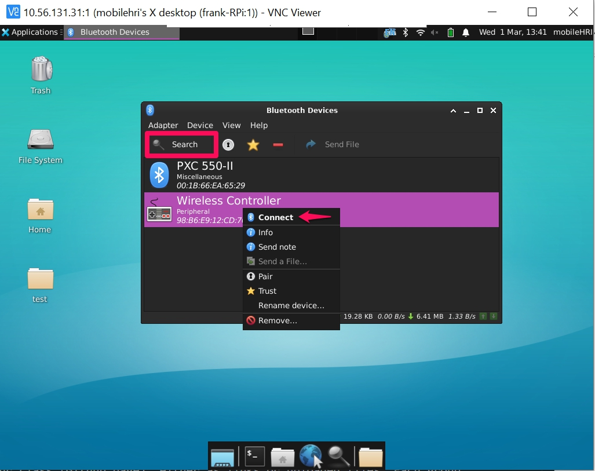
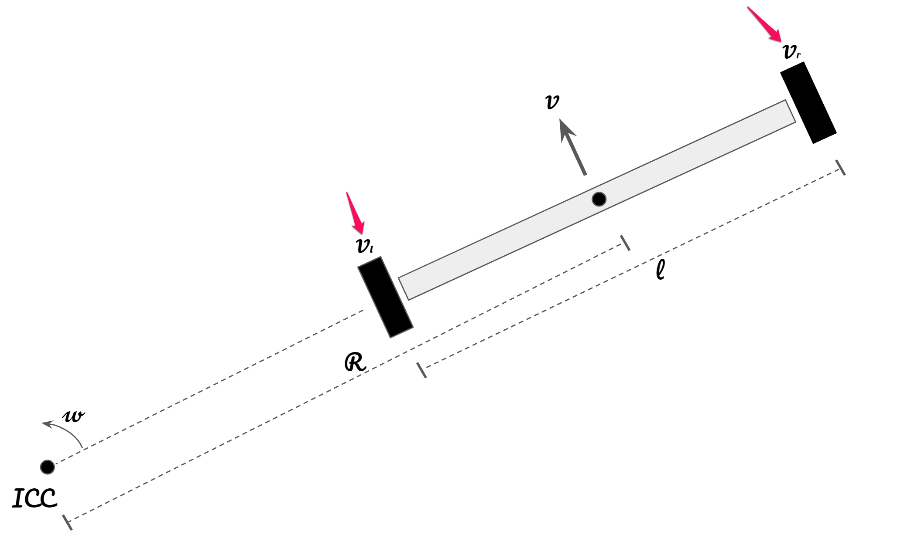

# Summer 2025 Trashbot Project
---

This is the official README file of the Summer 2025 Trashbot Project, an implementation of the [Mobile Robot Bootcamp](https://github.com/IRL-CT/Mobile_HRI_Lab_Hub/tree/main/Lab0) created by Professor Wendy Ju and Frank Bu. This README guides you through setting up and running the Trashbot prototype from scratch using a Raspberry Pi, ROS 2 Humble, Odrive.

---
## Purpose

The Trashbot project involves mounting a trash bin on a mobile robot platform to study human-robot interaction (HRI). Using the Wizard of Oz method, a human operator remotely controls the robot to simulate autonomous behavior, allowing researchers to observe and analyze how people interact with the robot in real-time scenarios.

## Part 1. Raspberry Pi Setup: Software Installation
This project uses **ROS 2 Humble**, which is primarily supported on Linux and Windows systems. While ROS traditionally has been Linux-focused, ROS 2 now supports multiple platforms. With your Raspberry Pi (Model 4), do the following:
1. Install **Ubuntu 22.04** on your Raspberry Pi by following the official instructions here: [Ubuntu for Raspberry Pi](https://ubuntu.com/download/raspberry-pi)
   - Flash Ubuntu 22.04 on the SD Card (e.g., 32GB Class 10 microSD card) in another system (e.g., macOS) via an SD Card Reader and then place the SD Card in it's respective slot in the Raspberry Pi.
2. After installing Ubuntu, install ROS 2 Humble by following these steps: [ROS 2 Humble Installation on Ubuntu](https://docs.ros.org/en/humble/Installation/Ubuntu-Install-Debs.html)
   - **Sourcing ROS 2**: In order to use ROS 2 commands, you need to source your environment, which means adding environment variables so your system knows where to find and how to run ROS 2 commands. This could be done in two ways: `source /opt/ros/humble/setup.bash` or `. /opt/ros/humble/setup.bash`. Make sure to run either command before you run any ROS 2 commands in a new terminal.
   - **Setting Up ROS 2 Workspace**: An ROS workspace is a directory that contains your ROS packages and follows a specific structure. Create the workspace and source folder by running: `mkdir -p ~/mobilehri_ws/src`.
   - **Creating the ROS Package**: Inside the workspace's `src` directly, create a package with dependencies:
     - `cd ~/mobilehri_ws/src`
     - `ros2 pkg create --build-type ament_python my_package --dependencies std_msgs rclpy.`
     - The resulting folder structure should look like this:
      ```plaintext
     - mobilehri_ws/
      └── src/
          └── my_package/
              ├── my_package/      # Python code goes here
              ├── package.xml      # Package metadata and dependencies
              ├── resource/        # Autogenerated by Python tools
              ├── setup.cfg        # Build configuration
              ├── setup.py         # Package setup script
              └── test/            # Tests
      ```
   - **Testing**: To test that ROS 2 successfully installed with an example, go to [ROS 2 Humble Installation on Ubuntu](https://docs.ros.org/en/humble/Installation/Ubuntu-Install-Debs.html) and try running the **Talker-listener** example.

---
## Part 2. Hardware Setup

You’ll need the following components to assemble your Trashbot:

### Materials
- 1 Deconstructed Hoverboard  
- 1 [Trash Can Dolly with Wheels](https://www.amazon.com/Rubbermaid-Commercial-Products-BRUTE-FG264000BLA/dp/B00002N8AI/ref=sr_1_3?crid=16FBLMR9AEEB1&keywords=Trash%2BCan%2BDolly%2Bwith%2BWheels&qid=1649170110&sprefix=trash%2Bcan%2Bdolly%2Bwith%2Bwheels%2Caps%2C90&sr=8-3&th=1) 
   - (Amazon link for the same piece we used)
- 1 [Circular Mounting Plate](images/trashbot_guidlines_inner.ai) 
   - (Laser cutting file)
- 1 [Circular Mounting Plate](images/trashbot_guidlines_all.ai)
   - (Laser cutting file)
- 2 Configured Raspberry Pis
- 1 [Breadboard](https://www.adafruit.com/product/1609?gad_source=1&gad_campaignid=21079227318&gbraid=0AAAAADx9JvStS3aXDb_mllD3Bp7VbBD-B&gclid=Cj0KCQjwzOvEBhDVARIsADHfJJQleAHXT8Y0V02g8GDo0Q8Qz8CXGuWnEYVbpuIQi6uBafvTW_3CEJoaAk30EALw_wcB)
- 1 ODrive Motor Controller  
- 1 XT60 Power Cable  
- 2 Filtering PCBs  
- 2 Hall Sensor Connectors  
- 2 Power Banks  
- 1 Lithium-Ion Power Battery  
- 1 USB-A to USB-C Cable  
- 1 HDMI to USB-A Cable  
- 1 8BitDo Lite2 Controller  
- 1 Resistor  
- 1 WiFi
- 1 Go Pro & Attachment
- 1 Trashbin
- ~10 Screws, ~8 Nuts, and ~2 Screwdrivers

           

### a. Setting Up the Dolly

1. **Remove** the circular top of the dolly to make room for mounting components.

   

2. **Laser-cut** the [drilling template + circular plate](images/trashbot_guidlines_all.ai). We suggest using 3mm or 5mm cardboard as the material here. Use the **outer part** as the **Drilling Template**. The inner part could be use as the template of the ODirve+Raspberry Pi holder.
   
  

3.  **Align** the dolly over the **Drilling Template** so the dolly's 5 smaller wheels surround the hoverboard's 2 larger wheels. **Locate** the 8 pre-existing screw holes on the hoverboard. Mark the positions of the 4 outer holes onto the dolly, then **drill 4 matching holes**.

      

4. **Secure** the dolly to the hoverboard using 4 screws and 4 nuts through the holes you just made.
5. If the cardboard template works well, **Laser-cut** the [circular plate](images/trashbot_guidlines_inner.ai). We recommend using 3mm acrylic board, but 3mm plywood would work as well. 
   
   

7. Inside the circular part of the dolly, **align the circular plate** with the 4 inner mounting holes. Mark the positions onto the plate.  
8. **Attach** the circular plate to the dolly using 4 more screws and 4 nuts.

### b. Attaching the Hardware

1. **Connect** the XT60 Power Cable to the ODrive (red = positive, black = negative).


2. **Mount** the ODrive to the circular plate using 2 screws and 2 nuts.


3. Made two customized soldered breadboard with capacitors to reduce the signal interference between two wheels for Motor0 and Motor1. See ODrive forum for the [detailed reasons](https://discourse.odriverobotics.com/t/encoder-error-error-illegal-hall-state/1047/12?page=2). Cut a portion from the breadboard, approximately half size of the 12-pin connector on the ODrive. **solder 3 22nF capacitors** and 5 connector pins on the breadboard base on this layout. Repeat for another one.



The wired breadboard with all the components should look like this:


Front



Back

**Solder** the hall sensor wires from the bottom of the hoverboard motors to the customized PCB, and route them through the rectanglar holes in the circular plate.

 - Ensure matching wire and pin: red to 5V,  yellow to A, blue to B, green to Z, and black to GND.
 - Place one breadboard on the far right side for M0; another right next to it (both leave 3.3V slot empty)

4. **Attach** the customized breadboard to the hall sensor connectors(notice we used a customized PCB, it has the same functionalites of the breadboard one you made):  


5. You will see **2 sets of yellow, blue, and green wires** (one from each motor). Route each set through the oval holes and screw them into the two green terminal blocks on the ODrive:  
   - **Left motor wires → Left terminal block**  
   - **Right motor wires → Right terminal block**  
   - **Wire order (left to right)**: Yellow, Blue, Green


6. **Insert** the resistor into the middle of the ODrive. You may also use it to help prop up the ODrive for stability.


7. **Connect** the motor-controller Raspberry Pi to the ODrive using the HDMI to USB-A cable. Set this Pi aside for now.
8. **Power** the ODrive by connecting the lithium-ion battery via the XT60 cable.
9. **Connect** a power bank to the first Raspberry Pi (USB-A to USB-C).
10. **Connect** the second power bank to the second Raspberry Pi (USB-A to USB-C).

 

Follow the GitHub Documentation [here](https://github.com/IRL-CT/Mobile_HRI_Lab_Hub/blob/main/Lab3/Readme.md#part-b-hardware-setup) for more information on the setup.

---
## Part 3. Making the Robot Move: Calibration
1. Use the [RPi Imager](https://www.raspberrypi.com/software/) to write [image](https://drive.google.com/file/d/1PMWyJUoA-CJ73vktrp3nPKiykwzOaauU/view?usp=sharing) to the SD cards (You will need to flash one card per group). [Online Guide](https://howchoo.com/pi/raspberry-pi-imager#write-a-custom-image). Please do this before Thursday's lab.
2. SSH into the Raspberry Pi that's connected to the ODrive.
```
# Open a terminal on your own laptop.
# The IP address for your RPi should be displayed on the miniTFT screen.
ssh mobilehri@YOUR-IP
# Replace YOUR-IP with the ip address displayed on your screen. (e.g. ssh mobilehri@10.55.131.31)
# Say yes if prompted.
# Enter in your password.
```
2. Download the initial parameters by running the following commands and open ODrive Tool:
```
# Download config file to your RPi
curl -LJO https://raw.githubusercontent.com/FAR-Lab/Mobile_HRI_Lab_Hub/main/Lab3/mobilehri_config.json
# Load the config file to your ODrive
odrivetool restore-config mobilehri_config.json
# Ignore the warnings about some parameters not being loaded. You will recalibrate the motors anyway.
# In the same remote session (RPi)
odrivetool
```
3. Since your ODrive is on (via the lithium power battery) you should have a message "Connected to ODrive xxxxxxxx" otherwise, you may want to re-connect the power battery. First, you will clear errors with `odrv0.clear_errors()` and dump errors with `dump_errors(odrv0)`
4. Calibrate both wheels with the following:
```
odrv0.axis0.requested_state = AXIS_STATE_FULL_CALIBRATION_SEQUENCE
odrv0.axis1.requested_state = AXIS_STATE_FULL_CALIBRATION_SEQUENCE
```
They should both be spinning in opposite directions.
5. Now, check if there were any errors with `dump_errors(odrv0)`. If there are any errors, first disconnect the lithium power battery and check that all the wires are secure and implemented correctly. Then, connect the battery again, and manually clear the errors. You could use [this](https://discourse.odriverobotics.com/t/list-of-all-commands/9773) as a reference.
6. Calibrate again, ensure it's successful with no errors. Once there's no errors, save and reboot:
```
odrv0.save_configuration()
odrv0.reboot()
```

Follow the GitHub Documentation [here](https://github.com/IRL-CT/Mobile_HRI_Lab_Hub/blob/main/Lab3/Readme.md#part-c-software-setup) for more information on the calibration of the wheels.

---
## Part 4. Making the Robot Move: Via Bluetooth

Now, let's control our robots to make them move intuitively. 

As you have seen, it's pretty easy to control the wheels with Python! However, it's not easy for us as humans to move the robot in ways that feel right while thinking in terms of individual wheel velocity. If you are a gamer, you might be pretty familiar with controlling avatars with joystick controllers or keyboard keys (WASD). In today's lab, let's map joystick controller commands to wheel velocities in Python.

## Prep

### For this part, you will need:
1. Your Computer
2. Joystick Controller
3. Your set of hoverboard + ODrive

## Lab Overview
For this assignment, you are going to:

A) [Connect Joystick Controller to RPi](#part-a-connect-joystick-controller-to-RPi)

B) [Read Messages from Joystick](#part-b-read-messages-from-Joystick)

C) [Make it rumble](#part-c-make-it-rumble)

D) [Map buttons to control](#part-d-map-buttons-to-control)

E) [Try it with your hoverboard!](#part-e-try-it-with-your-hoverboard!) 

## Part A. Connect Joystick Controller to RPi
Our wireless joystick controller connects to RPi through Bluetooth. 

If you are an old school terminal person, you can register your joystick through the command line via `bluetoothctl`([tutorial](https://www.makeuseof.com/manage-bluetooth-linux-with-bluetoothctl/)).

It is much easier to pair a bluetooth device in VNC viewer. 
1. Login to VNC viewer.
2. Setup bluetooth. 
Open a terminal on your RPi.
```bash
sudo apt install bluez*
sudo apt install blueman # not the musical group, it is short for bluetooth management. 
```
3. Open bluetooth management

4. Open your joystick controller and boot it to wireless pairing mode. Instructions are printed on the back of the box.
5. While your controller is double-flashing, click the search button in the bluetooth manager. You should be able to find your controller.  Right-click on the controller and select Connect. Once connected, your controller LED should turn blue.


## Part B. Read Messages from Joystick
Now, you have successfully paired your controller with your RPi. Let's access the values from the Joystick through ROS 2.

Open a terminal (either in VNC viewer or a local terminal that ssh to your RPi)
```bash
ros2 run joy joy_node
# You should see somthing like the following:
# [INFO] [1677696499.194657745] [joy_node]: Opened joystick: Wireless Controller.  deadzone: 0.050000
```
ROS 2 comes with a default package, `joy`, to communicate with joystick controllers. Recall that in Lab 0, you wrote your own publisher to publish a string under the topic `hri_topic`. The Joy package reads values from your controller and publishes your input under a specific topic. `joy_node` is the name of the executable that is actually linked to the underlying python script. They are defined in the `setup.py`. Now, let's find out which topic the joystick sends messages to!

<details closed>
<summary>More on `joy_node`</summary>

Recall in lab 1, where we turned your code from Lab 0 into Lab 1, we had the following script. 
```python
from setuptools import setup

package_name = 'my_package'

setup(
    name=package_name,
    version='0.0.0',
    packages=[package_name],
    data_files=[
        ('share/ament_index/resource_index/packages',
            ['resource/' + package_name]),
        ('share/' + package_name, ['package.xml']),
    ],
    install_requires=['setuptools'],
    zip_safe=True,
    maintainer='user',
    maintainer_email='user@todo.todo',
    description='TODO: Package description',
    license='TODO: License declaration',
    tests_require=['pytest'],
    entry_points={
        'console_scripts': [
            'talker = my_package.hri_publisher:main',       # NEW!
            'listener = my_package.hri_subscriber:main',    # NEW!
        ],
    },
)
```
In the `entry_point` section, we defined two entry points, `talker` and `listener` to the main functions we wrote in Python files. We are basically creating a shortcut for ROS 2 to find our code easily. Of course, we can also execute those functions directly through the command `python3` instead of `ros2`. This is just a good practice, to keep your code clean.
</details>

Leave the previous terminal running, and open a new terminal window:
```python
ros2 topic list
# You should see the following
''' 
/joy
/joy/set_feedback
/parameter_events
/rosout
'''
```
Let's see what's actually being published under the topic `/joy`. We will talk about `/joy/set_feedback` later. In the same terminal, enter
```
ros2 topic echo /joy
```
A lot of things are printing to the screen! Since the node is continuously publishing the message, I just copied one message below to demonstrate. **Try pressing different buttons and turning different knobs on the controller to see what changes. You should see something like: **
```
---
header:
  stamp:
    sec: 1677700131
    nanosec: 527338319
  frame_id: joy
axes:
- -0.0
- -0.0
- 1.0
- -0.0
- -0.0
- 1.0
- 0.0
- 0.0
buttons:
- 0
- 0
- 0
- 0
- 0
- 0
- 0
- 0
- 0
- 0
- 0
- 0
- 0
---
```

As you can see, all axes values are **continuous floats**, and all button values are **binary integers**. This is why we use joystick to control continous transitions, such as movement of avatars, and use buttons to toggle binary state. In python, `axes` and `buttons` are just arrays, which you can easily index into to select which button or joystick you are interested in. We will talk more about this in the next lab.


## Part C. Make it rumble!
Modern joystick controllers are not just simple input devices. They can also provide feedback to Wizard-users through haptic vibration (pretty common in shooting or racing games). In fact, tactile feedback can also carry rich information and is already ubiquitous (e.g. your phone provides plenty of tactile feedback to you).

If you are interested in controlling your robot through Wizard-of-Oz, it is worth considering what feedback you want to provide to the wizard. Of course, visual feedback is always important: the wizard needs to see the surroundings of the robot they are controlling. Beyond that, a touch of vibration would make the whole interaction more interesting. For example, you can make the joystick rumble when a person is near the robot.

To make the controller rumble, we will make use of the `/joy/set_feedback` topic. You have seen it earlier when you ran `ros2 topic list`. It is also provided by the `Joy` package. First, let's check out what kind of message this topic is expecting. We can use the command `ros2 topic info [TOPIC_NAME]` to inspect any active topic.

```bash
ros2 topic info /joy/set_feedback
# Type: sensor_msgs/msg/JoyFeedback
# Publisher count: 0
# Subscription count: 1
```
From returned information, we learned that this topic is expecting a sensor message of type `JoyFeedback`. Currently, no node is publishing on this topic, but there is one subscriber.

So, what's up with the JoyFeedback message? Let's see how it is [defined](http://docs.ros.org/en/api/sensor_msgs/html/msg/JoyFeedback.html).

Just in case you don't feel like clicking on the link above, I copied the message definition below. 
```bash
# Declare of the type of feedback
uint8 TYPE_LED    = 0
uint8 TYPE_RUMBLE = 1
uint8 TYPE_BUZZER = 2

uint8 type

# This will hold an id number for each type of each feedback.
# Example, the first led would be id=0, the second would be id=1
uint8 id

# Intensity of the feedback, from 0.0 to 1.0, inclusive.  If device is
# actually binary, driver should treat 0<=x<0.5 as off, 0.5<=x<=1 as on.
float32 intensity
```
A JoyFeedback message contains three field, type, id, and intensity. The type parameter specifies what kind of feedback we are dealing with. In our case, we want `TYPE_RUMBLE`. When we have multiple feedback devices, we want to specify which device we are talking about through `id`. We can go with default 0 for now. Note that intensity is defined as a number between 0 and 1. 

Now, let's publish some messages to the topic `/joy/set_feedback`. To be honest, I feel lazy now. I don't want to write an entire package, like what we did in Lab0, to publish a simple string. I want a quick-and-dirty way to debug and prototype. Luckily, ROS comes with plenty of command-line tools to make our lives easier. 

To publish messages to a topic through command line, use the following syntax:
```
ros2 topic pub [Frequency] [Topic Name] [Message Type] [Content]
```

In the following command, I am saying to publish message `"{type: 1, id: 0, intensity: 0.9}"` to `/joy/set_feedback` at 10 Hz. The message is of type `sensor_msgs/msg/JoyFeedback`.
```
ros2 topic pub -r 10 /joy/set_feedback sensor_msgs/msg/JoyFeedback "{type: 1, id: 0, intensity: 0.9}"
```

Try it! Make your controller rumble!

## Part D. Map buttons to control
I have written some code that subscribe to the `/joy` topic and publish a [twist](http://docs.ros.org/en/lunar/api/geometry_msgs/html/msg/Twist.html) message accordingly. A twist message consists of two vectors, one represents linear velocity and one represents angular velocity.

Now, clone the ROS 2 code base.
```bash
# On RPi
cd ~
mkdir -p ~/mobilehri_ws/src
cd ~/mobilehri_ws/src
git clone https://github.com/FAR-Lab/mobilehri2023.git 
cd ~/mobilehri_ws
colcon build
# Ignore the warnings. You should see the following.
# Summary: 3 packages finished [16.5s]
# 3 packages had stderr output: joy_teleop_keymapping mobile_robot_control picamera
```
Take a look at `https://github.com/IRL-CT/mobilehri_ws/src/mobilehri2023/joy_teleop_keymapping/joy_teleop_keymapping/keymapping_node.py`.
Pay attention to how the values are accessed from joystick controller and map to a twist message. 
```
source install/setup.bash
ros2 launch joy_teleop_keymapping mapping_launch.py
```
We start two nodes, the `joy` node from the previous section, and a `keymapping` node (that I wrote) to map joystick commands to twist messages (under `/cmd_vel`). We only concern overselves with the forward x-axis of linear velocity and upward z-axis of the angular velocity. (Why? Think about all the possible movements of a hoverboard.) 
```
# In a new terminal
ros2 topic echo /cmd_vel
# Hold down L1 button, then play with your joysticks to see what happens.
```
We defined the L1 button to be the safety button to avoid unintentional control, this is a simple `if` statement in the code.

> Feel free to customize our [code](https://github.com/IRL-CT/mobilehri_ws/src/mobilehri2023/joy_teleop_keymapping/joy_teleop_keymapping/keymapping_node.py) however you want. There are so many buttons and triggers on the controller, be creative!

## Part E. Try it with your hoverboard!
Let's do some math! In the previous step, we mapped joystick controller commands to a message type called twist (mainly linear velocity and angular velocity). We need another layer of computation to convert twist to commands that ODrive understands (angular velocity for wheels on each axis). Imagine the following simplified diagram. 

In this problem, the following variables are known
- $v$: robot linear velocity 
- $w$: robot angular velocity
- $l$: wheel track distance (distance between the wheels)
- $r$: wheel radius (not shown in the diagram)



When the hoverboard is moving in a straight line (forward/backword), the control is pretty straight forward. When the hoverboard is turning, the hoverboard must rotate about a point, Instantaneous Center of Curvature (ICC), that lies along the common left and right wheel axis (as shown above). (When the robot is moving in a straight line, Instantaneous Center of Curvature is infinitely distant)

The following variables are unknown (or difficult to track)
- $R$: radius for $ICC$
- $v_l$: what we need
- $v_r$: what we need

The key equation we need here is the relation between linear velocity and angular velocity, which we all learned at some point in physics. 
$v = wr$. Or  $w = \frac{v}{r}$. Linear velocity is the product of angular velocity and radius.

With that, we can easily express $v_l$ and $v_r$ as the following,
```math
v_l = w(R - \frac{l}{2}) = wR - \frac{lw}{2} 
```
```math
v_r = w(R + \frac{l}{2}) = wR + \frac{lw}{2}
```

Note that $v = wR$, so we can rewrite the above equations as the following
```math
v_l = wR - \frac{lw}{2}  = v - \frac{lw}{2} 
```
```math
v_r = wR + \frac{lw}{2}  = v + \frac{lw}{2}
```
Great! We get rid of $R$ in our equation, which we don't have access to in real time.

One last step, we need to convert individual wheel velocity to  angular velocity. We need to apply the magic equation again, but this time with wheel radius. I am going to abuse the symbol $v_l$ and $v_r$ here since that's what I used in the python code.
```math
v_l = (v - \frac{lw}{2})/r
```
```math
v_r = (v + \frac{lw}{2})/r
```

**Notice**: the code might differ with the specific hoverboards you use. Modify the code base on the dimension of the hoverboard you use. Wheel track distance is renamed as `self.wheel_track`. Change the wheel track distance to match your own robot. 

There are **TODO** lines in the `orive_commnad.py`. Please refer to our [sample code](https://github.com/IRL-CT/mobilehri2023/blob/c8c9d7ab1e6bb15e9d40d8b4d5e6aaeebdbeb43f/mobile_robot_control/mobile_robot_control/odrive_command.py#L86) for the whole implementation, but do chanage parameters before you start building.

```bash
# On RPi
cd ~/mobilehri_ws
colcon build
```

Now, try it out with your robot! Hook up both wheels to ODrive and connect to power (if the cable is too short, one wheel is okay for now).

```
source install/setup.bash
ros2 launch mobile_robot_control mobile_robot_launch.py
```

<details closed>
<summary>What is `ros2 launch`?</summary>
As your system scales up, you will run many nodes and define many parameters.
ROS 2 launch files are designed to help you organize your program execution and make start up process efficient.

If you take a look at `mobile_robot_launch.py` in `mobile_robot_control/launch/`, you will notice that we started three nodes in this file. If we do not have this launch file, we need to open three terminals and run `ros2 run` on each node.
    
The `joy_node` reads in controller commands, the `joy_teleop_keymapping_node` map controller commands to twist message (under topic `cmd_vel`), and the `mobile_robot_control_node` convert twist messages to individual wheel velocity through the math derivation above.

</details>

Now, press and hold `L1` on your controller and play with the two joysticks. Hopefully your wheels will start spinning now!

When all is set and done, place the trashbin on top of the bot and start moving around the trashbot!

#### Note: This README is being actively updated.
