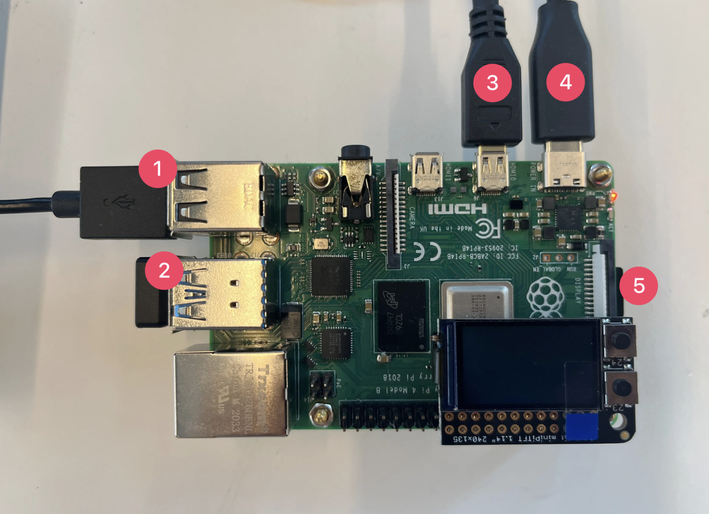

# Summer 2025 Trashbot Project
---

This is the official README file of the Summer 2025 Trashbot Project which is an implementation of the [Mobile Robot Bootcamp](https://github.com/IRL-CT/Mobile_HRI_Lab_Hub/tree/main/Lab0)
created by Professor Wendy Ju. This README covers the execution of the trashbot prototype from scratch. 

## Raspberry Pi Model 4 Setup

### Port Assignments
1. Keyboard connection  
2. Bluetooth mouse connection  
3. Monitor (HDMI) connection  
4. Power connection (USB-C)  
5. SD card slot

### Software Initialization
- Ensure the Raspberry Pi is running **Ubuntu 22.04**: [Ubuntu Raspberry Pi Installation Instructions](https://ubuntu.com/download/raspberry-pi)
- Follow the official guide to install **ROS 2 Humble** on Ubuntu: [ROS 2 Humble Installation Instructions](https://docs.ros.org/en/humble/Installation/Ubuntu-Install-Debs.html)

#### Note: This README is being actively updated.
